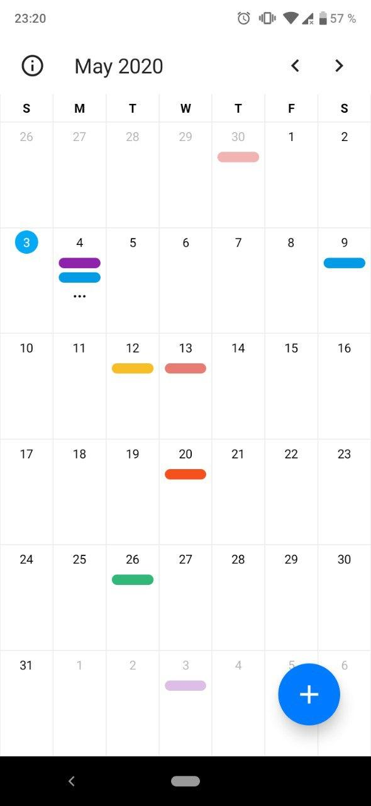
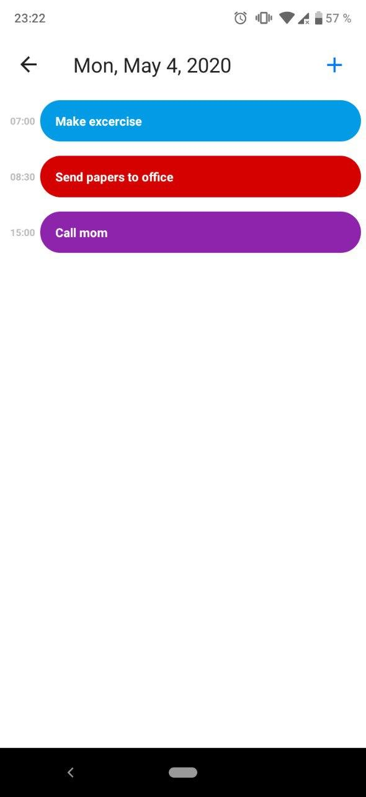
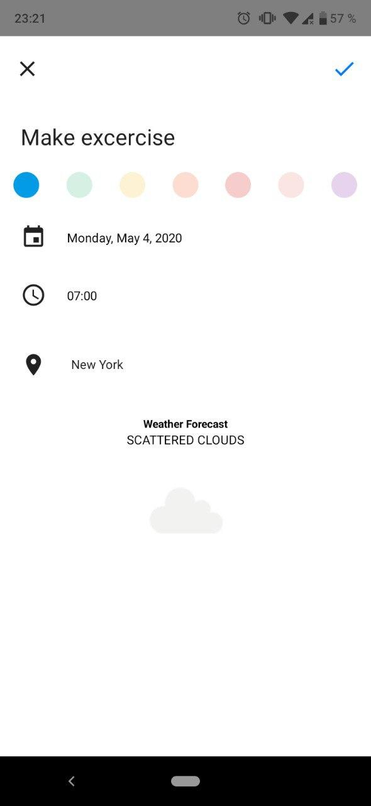
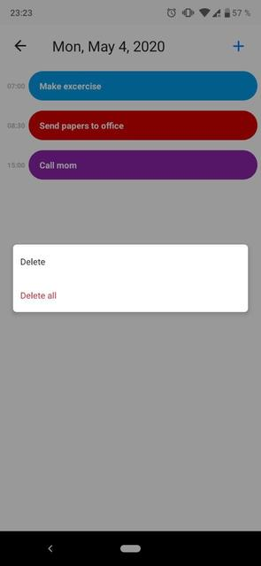

# React Native Calendar
A React Native Calendar app for Android\


## Prerequisites
* node >= 8.3.0
* npm >= 6.0.0
* react-native >= 0.60.0

## Installation
```
git clone https://github.com/charliegmv/ReactNativeCalendar.git
npm install
npx react-native start
npx react-native run-android
```

## Features
### Monthly reminders
You can review all reminders scheduled for a specific month. Each reminder is represented by its assigned color.
If there are multiple reminders for the same day, '...' is displayed as an indication that there are more than displayed sparing you the effort to try and read the reminders on micro size.

### Daily agenda
\
You can check your agenda for every day. No more blank spaces! All the reminders will be displayed in order, so you can organize yourself properly according to the activities you have planned.

### Create/update reminders
\
You can create a new reminder only by setting the date, time, a title for the activity and, optionally, the city where the reminder will take place. You can alse set a preferred color for your reminder, giving it even more passion. As an extra help, the app will show you the forecast weather for that city on the date and time set. Each reminder can be manually modified, if something changes your plan and you need to update the date or time.
(Note: The weather forecast will only be displayed for the current day and 4 days after that.)

### Delete reminders
\
Your plan changed for good? Don't worry! You can delete any reminder saved. Also, if you want to give yourself a day off you can delete all the reminders scheduled for a specific date.

## Developer
* [Charlie Medina](https://github.com/charliegmv) - Design and code.
